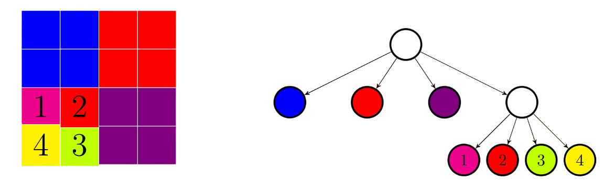

# Image Compression

## Overview

This project provides a simple image compression algorithm based on the quadtree data structure for PPM (Portable Pixmap) files. The accepted format is **P6**. The program focuses on dividing the image into small regions with similar colors, creating a quadtree based on that information, and storing it in a file.



## Table of Contents

-   [Overview](#overview)
-   [Table of Contents](#table-of-contents)
-   [Features](#features)
-   [Usage](#usage)
-   [Code Snippet & Math Equations](#quadtree-based-image-compression-algorithm---code-snippet)

# Features

-   Quadtree compression: The algorithm constructs a quadtree by recursively dividing the image into quadrants until it reaches a given tolarance. Each node in the quadtree represents a region of the picture.
-   Color reduction: By aggregating similar colors within a region, the algorithm reduces the number of distinct colors required to represent the image accurately, further reducing the file size.
-   Lossy compression: The compression algorithm discards some color information, resulting in a lossy compression scheme. However, the visual quality remains high, and the human eye perceives minimal differences.
-   Decompression: The compressed image can be efficiently decompressed to recreate the original image with a minor loss of quality.
-   PPM format support: The implementation is designed to work with PPM files, especially the P6 format and momentarly on equal proportions.

## Usage

1.  Ensure that the input image is in the [PPM Format ](https://netpbm.sourceforge.net/doc/ppm.html).
2.  Run the compression program with the desired compression parameters.
    > The compression parameters are the maximum number of colors in the compressed image and the maximum difference between the original and the compressed image.
    >
    Example:
    ```
    ./quadtree < -c1 mean | -c2 mean | -d > <input_file> <output_file>
    ```
    > -c1 : The -c1 flag is optinal. It will print general information about the compression process (like the number of levels of the quadtree, the number of colors and the size of a colored node <pixel count>).
    >
    > -c2 : The program will compress the image until the difference between the original and the compressed image is less than the second compression parameter.
    >
    > -d  : The program will decompress the image.
    >


## Quadtree-based Image Compression Algorithm - Code Snippet

```c
void CompressImage(RGB ***imageMatrix, TTree *arb, unsigned int size, unsigned int startX, unsigned int startY, unsigned long long similarity, unsigned int *nodeMaxSize)
{
    if (size <= 0)
        return;

    RGB avgColor = AvgColor(*imageMatrix, size, startX, startY);
    unsigned long long mean = avgMean(*imageMatrix, avgColor, size, startX, startY);

    if (mean > similarity)
    {
        *arb = InitNode();

        CompressImage(imageMatrix, &(*arb)->topLeft, size / 2, startX, startY, similarity, nodeMaxSize);
        CompressImage(imageMatrix, &(*arb)->topRight, size / 2, startX, startY + size / 2, similarity, nodeMaxSize);
        CompressImage(imageMatrix, &(*arb)->botLeft, size / 2, startX + size / 2, startY, similarity, nodeMaxSize);
        CompressImage(imageMatrix, &(*arb)->botRight, size / 2, startX + size / 2, startY + size / 2, similarity, nodeMaxSize);
    }
    else
    {
        int length = size;
        if (length > *nodeMaxSize)
            *nodeMaxSize = length;

        *arb = InitCNode(avgColor.red, avgColor.green, avgColor.blue);
        return;
    }
}
```
-   The function CompressImage is the core of the compression algorithm. It recursively divides the image into quadrants until it reaches a given tolarance. Each node in the quadtree represents a region of the picture.
-   The function AvgColor calculates the average color of a region.

$$
    red = \frac{1}{size * size} * (\sum_{i=x}^{x + size} \sum_{j=y}^{y + size} imageMatrix[i][j].red)
$$
$$
    green = \frac{1}{size * size} * (\sum_{i=x}^{x + size} \sum_{j=y}^{y + size} imageMatrix[i][j].green)
$$
$$
    blue = \frac{1}{size * size} * (\sum_{i=x}^{x + size} \sum_{j=y}^{y + size} imageMatrix[i][j].blue)
$$
-   The function avgMean calculates the average mean of a region.

$$
    mean = \frac{1}{3 * size^2} * (\sum_{i=x}^{x + size} \sum_{j=y}^{y + size} (red - imageMatrix[i][j].red)^2 + (green - imageMatrix[i][j].green)^2 + (blue- imageMatrix[i][j].blue)^2)
$$